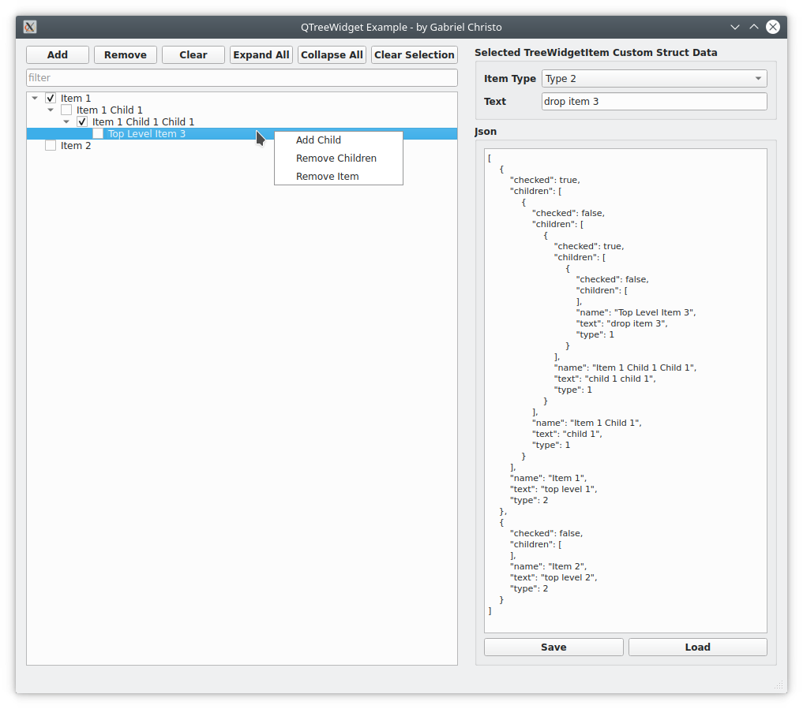

# Qt Custom Tree #
A qt single column treewidget example, with:

- json serialization
- custom data in each tree node (qvariant)
- dynamic adding and removing nodes
- context menu
- drag and drop
- item name filter

# ToDo #
- filter on child items
- signal to update json text on dropped item
